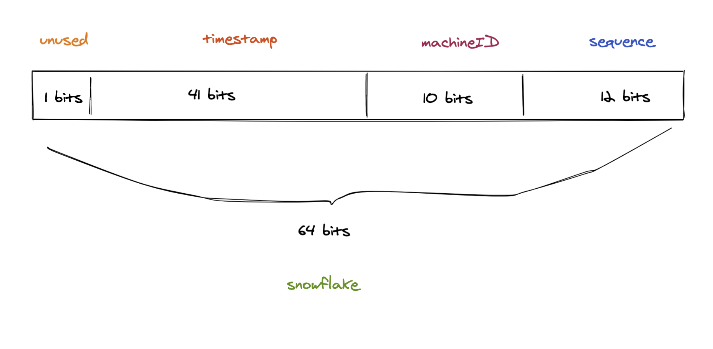

## snowflake


分布式自增id算法


### 1) 简介

`snowflake` 是 `Twitter`开源的分布式ID生成算法，结果是一个long型的ID( 64bits )。其核心思想是：

```js
41bit 作为毫秒数，

10bit 作为机器的ID（5个bit是数据中心，5个bit的机器ID），

12bit 作为毫秒内的序列号(sequence)（意味着每个节点在每毫秒可以产生 4096 个 ID），

最后还有 1bit 作为符号位，永远是0。
```





### 2) 优点

```js
1.快
2.没有啥依赖，实现也特别简单。
3.方便灵活。
```

比如 `10 bits` 的 `machineID` 可以自由进行拆分, 一般来说可以拆成 `3bits` 的数据中心id , `7bits` 的机器id


### 3) 缺点

```js
1. 只能趋势递增。
2. 依赖机器时间，如果发生回拨会导致可能生成id重复
```


### 4) 实现步骤

```js
1. 获取当前的毫秒时间戳；
2. 用当前的毫秒时间戳和上次保存的时间戳进行比较；
			如果和上次保存的时间戳相等，那么对序列号 sequence 加一；
			如果不相等，那么直接设置 sequence 为 0 即可；
然后通过或运算拼接雪花算法需要返回的 int64 返回值。
```


### 5) 代码地址

https://github.com/sado0823/go-snowflake